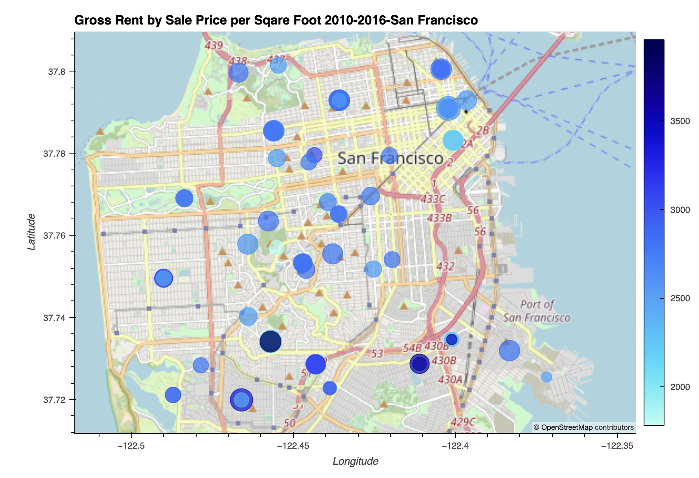

# Housing in San Francisco 2010-2016

The notebook is used to visualize the housing market in San Francisco from 2010 through 2016 using hvPlots as a visualization.

---

## Technologies

Python 3.9

* [pandas](https://pandas.pydata.org/docs/getting_started/overview.html) 
* [pathlib](https://docs.python.org/3/library/pathlib.html)
* [hvplot](https://hvplot.holoviz.org/)

---

## Installation Guide

```python
  pip install pandas
  pip install pathlib
  pip install hvplot
```

---

## Usage

This notebook is a visualization of San Francisco from 2010-2016 but could be alterted to use a csv file that contains other city's housing markets. The only contraints are the column names need to be changed in either the notebook or csv file to fit their oppropriate use. For some visualization a longitude and latitude needs to be provided to work properly.


---

## Contributors

Main contributer **Santiago Hernandez**
- [dsmannight@gmail.com](dsmannight@gmail.com)

---

## License

This application is free for non-profit use.
